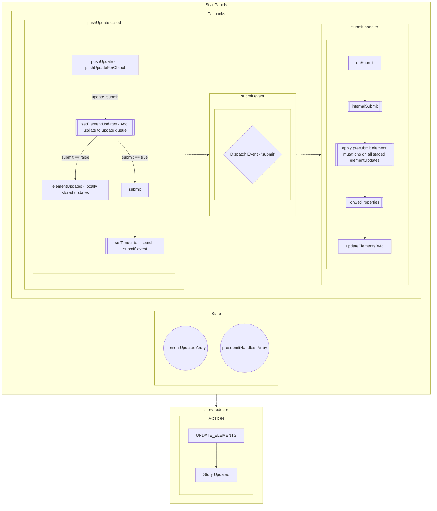

# Design Panel Element Update Data Flow

Below is a rough outline of the data flow following input change updates in the design panel to how they update the element in the top level story provider. Most of this code can be found in `packages/story-editor/src/components/style/designPanel.js` :

## Current Usage

Most of the time, we are passing `submit` as `true` for the `pushUpdate(update, submit)` or `pushUpdateForObject(...)` callback args. The current setup is mainly used so the presubmit hooks can alter an update to an element before sending the element updates to the story reducer. Most precommit hooks do things like clamp a value within a certain range, or resize the text element depending on updates to text properties.

