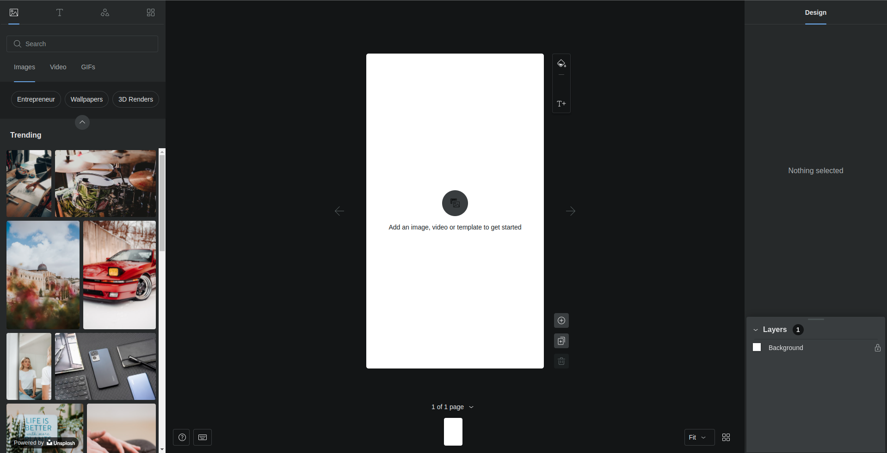
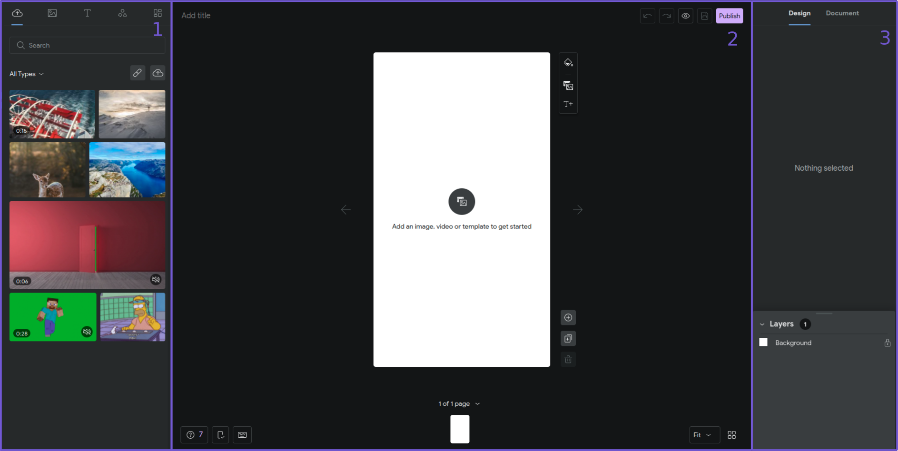
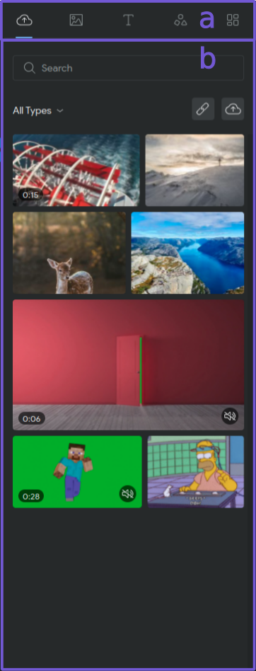
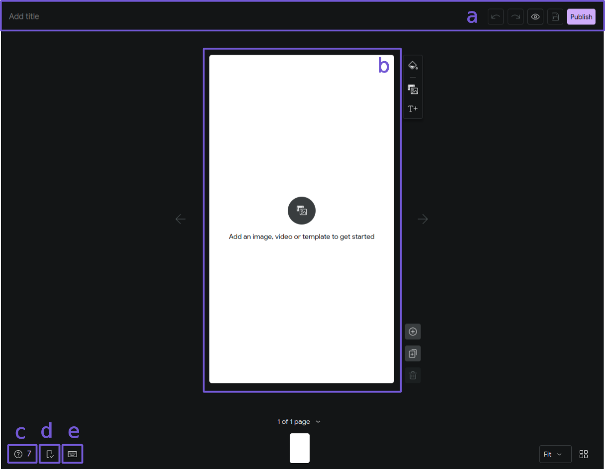
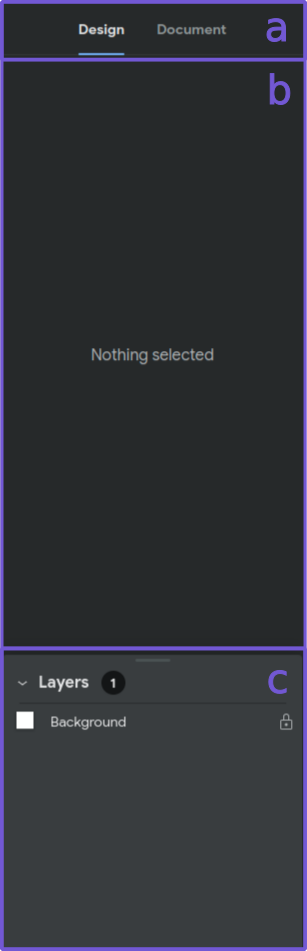

# Getting Started

Welcome to Web Stories developer docs! Here you will learn about the Web Story editor, a WYSIWYG editor to create web stories, and how to integrate it with any platform. 

The documentation is divided into 3 major sections

- Getting Started - This current doc provides a setup guide to instantiate a story editor with bare minimum functionality and explains significant UI elements of the editor.
- [Standalone Editor Tutorial](../standalone-editor-tutorial/standalone-editor-tutorial.md) - A tutorial to create a standalone story editor which works without a CMS.
- [Integration Layer API](../integration-layer-api/integration-layer.md) - A comprehensive guide on the integration layer of the Story Editor


## Minimal Setup Guide

You can quickly spin up a story editor in a few steps described below.

### Step 1: Set up a React project

The easiest way of setting up an SPA React project is to use [CRA](https://create-react-app.dev/) or to use templates such as [react-boilerplate](https://github.com/react-boilerplate/react-boilerplate).

### Step 2: Install dependencies

For a minimal story editor, you only need to install a single package `@googleforcreators/story-editor`.

```sh
npm install @googleforcreators/story-editor
```

### Step 3: Use the `StoryEditor` component to render the editor

If you have used CRA, simply replace the contents of `src/App.js` with the code sample given below.

```jsx
import { StoryEditor, InterfaceSkeleton } from '@googleforcreators/story-editor';

const Editor = () => {
  const apiCallbacks = {
    saveStoryById: () => Promise.resolve({}),
  };

  return (
    <StoryEditor config={{ apiCallbacks }} initialEdits={{ story: {} }}>
      <InterfaceSkeleton />
    </StoryEditor>
  );
};

export default Editor;
```

( You may have to wrap the editor in `<div style={ { height: '100vh' } }>`,  if the parent container doesn't have any height set )

You should now have the story editor that looks like this.



For a more in-depth example of making a custom story editor see [Standalone Editor Tutorial](../standalone-editor-tutorial/standalone-editor-tutorial.md)

## Meet The Story Editor

Now that you have a Story Editor up and running, let's get to know a little about it. You can learn more about all possible visual and functional customizations by reading [Standalone Editor Tutorial](../standalone-editor-tutorial/standalone-editor-tutorial.md) and [Integration Layer Docs](../Integration-Layer-API/Integration-Layer-Docs.md).

The Story editor has 3 main areas that one should know about



### Element Library - (1)

All elements which can be added to a story live here. This area has 2 main parts **Library tabs** and **Library Pane**.



**Library Tabs (a)** has tabs selector corresponding to every kind of element which can be added to a story. Selecting a new tab related to an element will show its library in the **Library Pane**.

**Library Pane (b)** will have a list of elements corresponding to the element type selected from **Library Tabs** is displayed here. An element's **Library Pane** may have some additional Interfaces for providing additional functionalities.
	

### Workspace - (2)



This is the main area which includes page thumbnails, page( canvas ), help center, checklist, title and saving-related buttons etc. 

**Header - (a)**: The top section of this area is reserved to add story title and buttons for saving story.

**Page (Canvas) - (b)**: The main ‘canvas’ that shows the current story page. This is where most of the action happens, and the user designs via drag & drop and other actions.

**Help Center - (c)** Special assistive mode that when active, offers design suggestions to aid the user in producing a beautiful, functional story. Additional tips can be added for custom integrations (checkout [Integration Layer Docs](../Integration-Layer-API/Integration-Layer-Docs.md) for more information).

**Checklist-(d)**: The checklist represents another, cleaner way of browsing through all current errors, warnings and suggestions that originate while working with the story.

**Keyboard Shortcuts List - (e)**: Provides a list of shortcuts that can be used by a user to optimize their workflow.

### Inspector Tabs - (3)



**Inspector Tabs**: This by default has UI interfaces to edit properties of any selected element in the **Design Tab**. An additional panel named **Document tab** can be added to provide controls for story description, publishing, permalink and taxonomies etc.

To learn how to configure a customized **Document Tab** see [Integration Layer Docs](../Integration-Layer-API/Integration-Layer-Docs.md).
At the bottom of this area, a **Layers (c)** interface is also present for users to configure layers of the current page visible on the canvas.

### Next

Now that you have been introduced to the Story editor, you can now jump into [Standalone editor tutorial](../standalone-editor-tutorial/standalone-editor-tutorial.md) to learn how to make a standalone editor by expanding capabilities of the minimal editor presented in this document.

